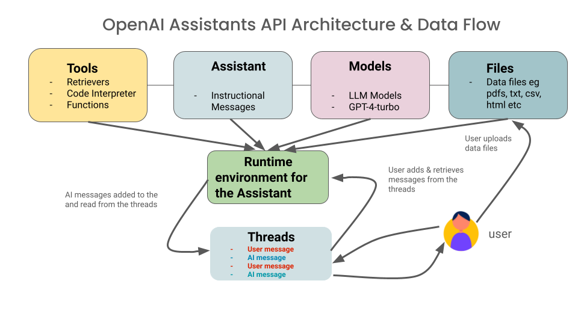

# OpenAI Assistants APIs

The Assistants' API lets you create AI assistants in your applications. These assistants follow instructions and use models, tools, and knowledge to answer user questions. Currently, it supports tools like Code Interpreter, Retrieval (for files uploaded), and Function Calling. The OpenAI aims to add more tools and enable you to add your own tools to our platform in the future. This extends your LLM applications to interact, via tools, to external sources.

The architeture and data flow diagram below depicts the interaction among all
components that comprise OpenAI Assistant APIs. Central to understand is the 
Threads and Runtime that executes anyschronously, adding and reading messages
to the Threads.

image inspired by[ source](https://www.youtube.com/watch?v=yzNG3NnF0YE)

In the notebooks in this secion, we will explore how you can use Assistants APIs for:
 * Retrievals
 * Functions 
 * Code Interpreters

### WIP 🚧
