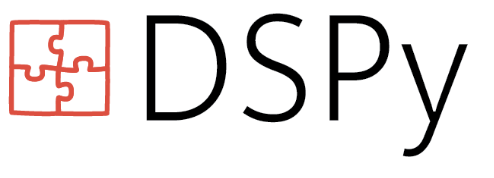

## DSPy - Programming with Foundation Models

### Quick overview: what and why use DSPy
DSPy, pronounced Dee-s-pie, is a framework for optimizing Language Model (LM) prompts and weights in complex systems, especially when using LMs multiple times within a pipeline. 

The process of using LMs without DSPy involves breaking down problems into steps, prompting the LM effectively for each step, adjusting steps to work together, generating synthetic examples for tuning, and finetuning smaller LMs to reduce costs. This process is currently challenging and messy, requiring frequent changes to prompts or finetuning steps whenever the pipeline, LM, or data are altered. 

DSPy addresses these issues by separating program flow from LM parameters and introducing new optimizers that tune LM prompts and/or weights based on a desired metric. DSPy can train powerful models like GPT-3.5 and GPT-4, as well as smaller models such as T5-base or Llama2-13b, to perform more reliably at tasks by optimizing their prompts and weights. 

DSPy optimizers generate custom instructions, few-shot prompts, and weight updates for each LM, creating a new paradigm where LMs and their prompts are treated as optimizable components of a larger learning system. 

In summary, DSPy enables less prompting, higher scores, and a more systematic approach to solving complex tasks using Language Models.

**Summary**: 
1. DSPy is a framework for optimizing LM prompts and weights in complex systems.
2. Using LMs without DSPy requires breaking down problems into steps, prompting effectively, adjusting steps, generating synthetic examples, and finetuning smaller LMs.
3. This process is challenging due to frequent changes needed when altering pipelines, LMs, or data.
4. DSPy separates program flow from LM parameters and introduces new optimizers that tune prompts and weights based on a metric.
5. DSPy can train powerful and smaller models to perform more reliably at tasks by optimizing their prompts and weights.
6. DSPy optimizers generate custom instructions, few-shot prompts, and weight updates for each LM.
7. This new paradigm treats LMs and their prompts as optimizable components of a larger learning system.
8. Less prompting is required with DSPy, leading to higher scores
9. The approach is more systematic and addresses the challenges of using LMs in complex systems.
10. DSPy enables a new way to train and utilize Language Models effectively

_The above text is generated using DSPy module and OLlama LLM running locally on a laptop to summarize a long excerpt from the DSPy documentation. Check the module source [here](./03_dspy_nlp_tasks.py)_

### Python Notebooks and Code Examples

The Python code examples illustrate programming the LLM with in-line DSPy signatures and Class Signatures modules, no prompting required, except for task declared in the class
`doc` string, in short and succint wording the task at hand.

It also demonstrates to conduct common NLP tasks using DSPy Signature and Preduct modules, rather than explicity 
prompting the LLM; the prompt are internally constructed
via the Signature.

All examples use OLlama Mistral, running locally on the laptop, and experimental DSPy [dspy.OLlama](https://dspy-docs.vercel.app/docs/building-blocks/language_models#local-lms) client integration APIs. Have a peek 👀 on GitHub!

 **Note** that some of these NLP tasks have been converted from [LLM Prompts notebook](https://github.com/dmatrix/genai-cookbook/blob/main/llm-prompts/2_how_to_conduct_common_nlp_llm_tasks.ipynb) using [CO-STAR framework](https://towardsdatascience.com/how-i-won-singapores-gpt-4-prompt-engineering-competition-34c195a93d41) prompt techniques, illustring how you can effect the same results declaratively, meaning expression _what_ not _how_ to do the task.

#### Python Notebooks
| Notebook Description| Open with Colab |
|--------------------|-----------------|
| Common NLP Tasks with DSPy Signature Modules |  |
| Chain of Thought (CoT) Tasks with DSPy Modules |  |
| Program of Thought (PoT) Tasks with DSPy Modules |  |

#### Python Apps

| Python file  Description| View it on Github |
|-------------------------|-------------------|
| Basic inline DSPy signatures for LLM tasks| [Python App](https://github.com/dmatrix/genai-cookbook/blob/main/dspy/01_basic_inline_dspy_signature_example.py) |
| Basic Class Signature modules for LLM Tasks |[Python App](https://github.com/dmatrix/genai-cookbook/blob/main/dspy/02_basic_class_dspy_signature_example.py)|
|Common NLP Tasks with DSPy Modules| [Python App](https://github.com/dmatrix/genai-cookbook/blob/main/dspy/03_dspy_nlp_tasks.py)|
|Chain Of Thought Tasks with DSPy Modules| [Python App](https://github.com/dmatrix/genai-cookbook/blob/main/dspy/05_dspy_chain_of_thought_tasks.py)|
|Program Of Thought: Python code generation tasks with DSPy Modules| [Python App](https://github.com/dmatrix/genai-cookbook/blob/main/dspy/07_dspy_program_of_thought.py)|

### DSPy Documentation
 1. [Programing--not Prompting--LLMs](https://dspy-docs.vercel.app/)
 2. [Get started with DSPy](https://dspy-docs.vercel.app/docs/intro)
 3. [Tutorials and Examples](https://dspy-docs.vercel.app/docs/category/tutorials)
 4. [API Reference](https://dspy-docs.vercel.app/api/intro)
 5. [DSPy GitHub](https://github.com/stanfordnlp/dspy)

 ### References and Sources

 1. [DSPy: Compiling Declarative Language
Model Call into Self-improving Pipelines](https://arxiv.org/pdf/2310.03714)
2. [Intro to DSPy: Goodbye Prompting, Hello Programming!](https://towardsdatascience.com/intro-to-dspy-goodbye-prompting-hello-programming-4ca1c6ce3eb9)
3. [DSPy Explained!](https://youtu.be/41EfOY0Ldkc?si=WN4_t5YgmGVFMhiM)
4. [A gentle introduction to DSPy](https://learnbybuilding.ai/tutorials/a-gentle-introduction-to-dspy)

### WIP 🚧
