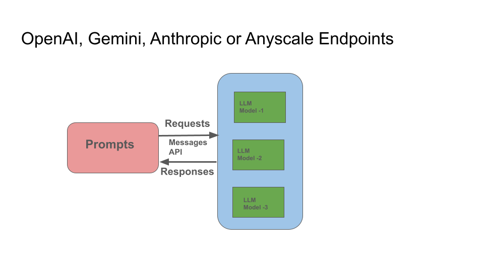

## The fundamentals of Prompt Engineering.

Welcome to this section on prompt engineering, tailored for anyone seeking practical insights into prompt engineering to use LLMs. We kick off with the basics of simple prompting, guiding you on crafting effective prompts: a fundamental skill for various generative tasks. Journey with me into text generation and completion, exploring tips for text summarization and extracting key information seamlessly:

 

    
Learn techniques for text classification and sentiment analysis, honing your ability to guide language models accurately. The exploration extends to text categorization, text transformation, and translation, where you'll witness language models reshaping and interpreting content. Then take a deep dive into how to ask LLM to approach simple and complex reasoning tasks, empowering you to guide models through logical challenges, and then cap it off with code generation: 

 

Vision-to-text models are like intelligent computers that look at pictures and describe them using words, forming a bridge between visual understanding and language processing. These models are valuable for tasks such as creating captions, assisting individuals with visual impairments, and enhancing computers' ability to comprehend and articulate the content of images. As they continue to advance, vision-to-text models contribute to a more nuanced and interactive relationship between computers and the visual world. We explore that vision capability in this notebook:

## Zero-shot prompting

Zero-prompt learning is a challenging yet fascinating area where models are trained to perform tasks without explicit learning examples in the input prompt. Here are some notable examples that can be used with GPT-3 and Llama Language Models.

GPT-3, Llama 2, and Claude are powerful language models. The have demonstrated zero-shot learning. That is, without specific learning prompts or examples, it can generate coherent and contextually relevant responses, showcasing its ability to understand and respond to diverse queries.

 

## Image Classification:

In zero-shot image classification, a model can classify images into categories it has never seen during training. This is achieved without providing explicit examples of those new categories, showcasing the model's ability to generalize.

## Natural Language Processing (NLP)

### Text Summarization:

Models trained for zero-prompt text summarization can generate concise and meaningful summaries without receiving explicit instructions. The model learns to distill key information from the input text.

### Anomaly Detection:

In zero-shot anomaly detection, models can identify unusual patterns or outliers in data without being explicitly trained on examples of anomalies. This is particularly useful in cybersecurity and fraud detection.

### Language Translation:

Zero-shot learning in language translation allows models to translate languages they haven't seen during training. The model learns to generalize its translation capabilities without specific examples for each language pair.

### Named Entity Recognition (NER):

Models trained with zero-prompt learning for NER can identify and categorize named entities in text without being explicitly provided with examples for each specific entity.

### Dialogue Generation:

Zero-shot dialogue generation models can engage in conversations and respond appropriately to user input without being given explicit dialogues as training examples.

| Notebook Description| Open with Colab |
|---------------------|-----------------|
|Natural language Processing(NLP)| |
|Zero shot learning  | |

### Speech Recognition:

Models trained for zero-shot speech recognition can accurately transcribe spoken words even in languages or accents not explicitly included in the training data.

These examples highlight the remarkable capacity of models to generalize and adapt to diverse tasks or data distributions without relying on explicit prompts or examples during training. 

Note: Except for image classification and speech recognition, which require GPT-4 or multi-model LLMs, all notebooks in `llm-prompts` are examples of zero-shot learning. To extend those examples, I have added additional how-to guides for NER and Dialogue generation.

## Few-shot prompting

Few-shot learning is a machine learning paradigm where a model is trained to perform a task with very few examples or prompts. Unlike traditional machine learning that often requires large amounts of labeled data, few-shot learning enables models to generalize and adapt to new tasks with minimal examples. This is particularly useful in scenarios where obtaining extensive labeled datasets is challenging or impractical.

Few-shot prompting is akin to an early fine-tuning stage for training models on specific, small datasets or formats. It involves incorporating limited examples as part of the prompt context, encompassing both zero-shot and few-shot prompting in this fine-tuning section.

### When to Use Few-shot Learning:

There are few examples where few-shot learning is applicable. 

#### Rapid Adaptation:

When you need a model to quickly adapt to new tasks or domains with minimal training data, few-shot learning allows for rapid learning and deployment.

#### Limited Labeled Data:

Few-shot learning is beneficial when you have a limited amount of labeled data for a specific task, making it challenging to train a traditional model effectively.

Let's explore couple of examples of few-short prompt learning in our our notebook: 

 

Whether you're a novice or seasoned developer, this how-to guide equips you with practical tools to leverage prompt engineering across diverse generative applications. 

**Note**: To run and open these notebooks in your Google Colab, you
will need the .env files as well as all the required packages installed
in your Google Colab environment.

## Chain of Thought Reasoning

Chain of thought prompting for LLMs involves providing a sequence of reasoning steps in the prompt to guide the model toward a solution. This technique helps the model to process complex problems by breaking them down into intermediate steps, much like a human would. By mimicking human-like reasoning, chain of thought prompting improves the model's ability to handle tasks that require logic and deduction.

Wei et al. (2022) introduced chain-of-thought (CoT) prompting, which uses steps to help solve complex problems. By adding few-shot prompts, it works even better for tasks that need careful thinking before answering, giving the model time to "think." This can simply be achieved as prompting or instructing the LLM to "Let's think through this step by step. Solve each step and explain how to arrive at your answer." These instructions eliminate the need to explicitly provide "few-shot" examples. This combination helps in tackling more difficult tasks effectively.

Let's look at a few of those examples in this notebook:

## ReAct Prompting

First introduced in a paper by Yao et al., 2022, ReAct is a reasoning and acting paradigm that guides LLM to respond in a structured manager to complex queries. Reasoning and actions are interleaved and progressive, in the manner of chain of thought, so that LLM progresses from one result to another, using the previous answer.

Results suggest that ReAct outperforms other leading methods in language and decision-making tasks, enhances human understanding and trust in large language models (LLMs). It and best when combined with chain-of-thought (CoT) steps as individual tasks with results being used for the next step, utilizing both internal knowledge and external information during reasoning.

Let's first use a few-shot examples to indicate how an LLM should progress with its reasoning and acting to solve a complex query, requiring intermideiate results to progress to its final outcome.

## Table of contents for the notebooks in this directory.
| Notebook Description| Open with Colab |
|--------------------|-----------------|
| Basic prompting    |  |
| Prompt for basic NLP tasks |  |
| Use vision model for classification and text generation |  |
| Use zero-shot learning prompts |  |
| Use few-shot learning prompts |  |
| Use chain of thought prompts |  |
| Use ReAct prompt techniques |  |
| Use Code Llama for code generation |  |
| Use Anthropic Claude 3 for basic prompts| | 
| Use Anthropic Claude 3 for NLP tasks | | 
| Use Anthropic Claude 3 for NLP tasks | | 

Let's dive & swim 🐬 in 