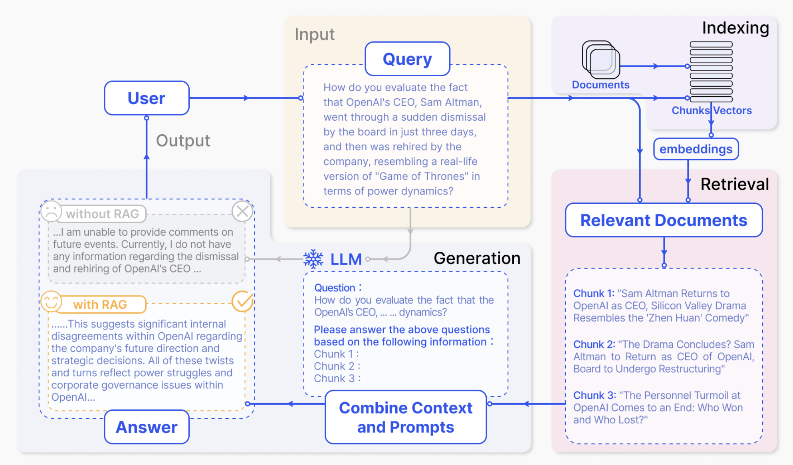

### What is a Retrieval Augmented Generation (RAG)?
This is not likely your first read on RAG, nor likely a last one either. For RAGs are the new rage--rapidly evovling and continually improving--in Generative AI applications, and their remarkable success is for good reasons. 

Armand Ruiz states that RAG marks "a significant evolution in the field of AI, particularly in enhancing the capabilities of large language models (LLMs)." [1] 

Likewise, Gao et al. [2] expand on this notion that RAG has emerged as a promising [AI] solution by incorporating knowledge from external databases and enhancing the accuracy and credibility of the generation, particularly for knowledge-intensive tasks and for continuous knowledge updates and integration of domain-specific information.

Another simpler way to put it: RAG is an AI pattern or a technique where LLMs are provided with augmented context from an external datasource, such as databases, vector stores, dynamic data files, customer records and product descriptions, along with the orignal user query for response generation. 

Combining external context, retrieved from the vector store, with orignal user query or input allows LLM to generate an enhanced, accurate, and context-tailored specific response, as depicted in the high-level data flow in Figure 1.

### Why use RAG?

### Typical Architecture and Components 

### How RAG Works?

### Common Use Cases

### Benefits of RAG

### What Architectural Framework?

### RAG vs Fine-Tune

### Challenges and Future Developments

### Summary

### References and Resources

1. https://newsletter.nocode.ai/p/guide-retrieval-augmented-generation
2. https://arxiv.org/pdf/2312.10997.pdf
3. https://www.elastic.co/search-labs/blog/rag-with-llamaIndex-and-elasticsearch

### WIP 🚧