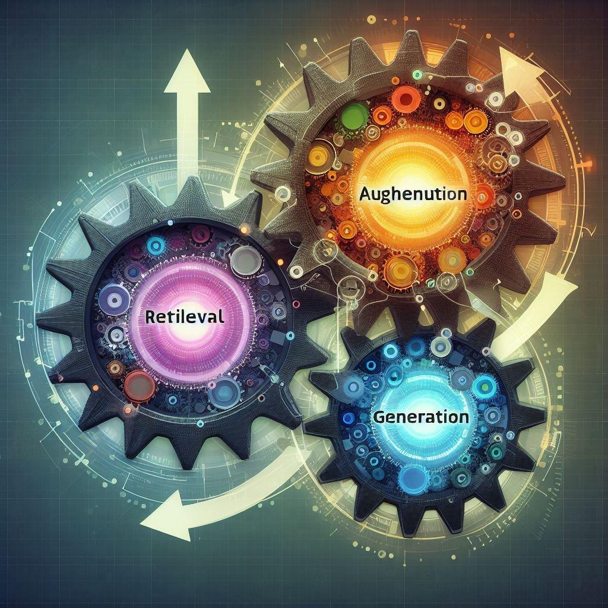
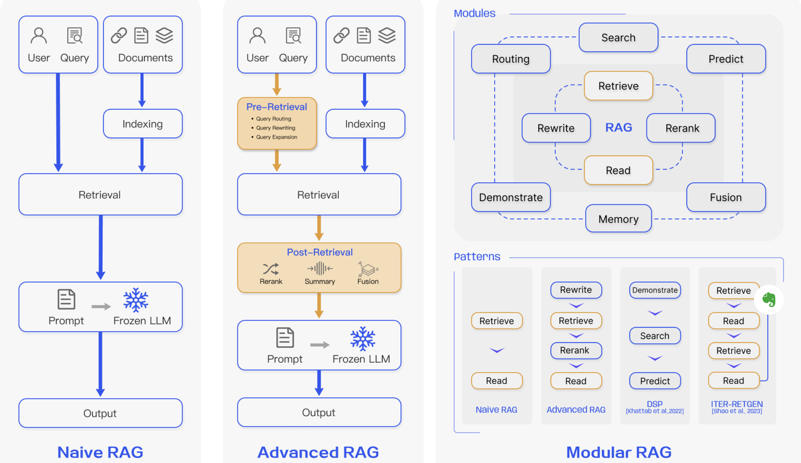
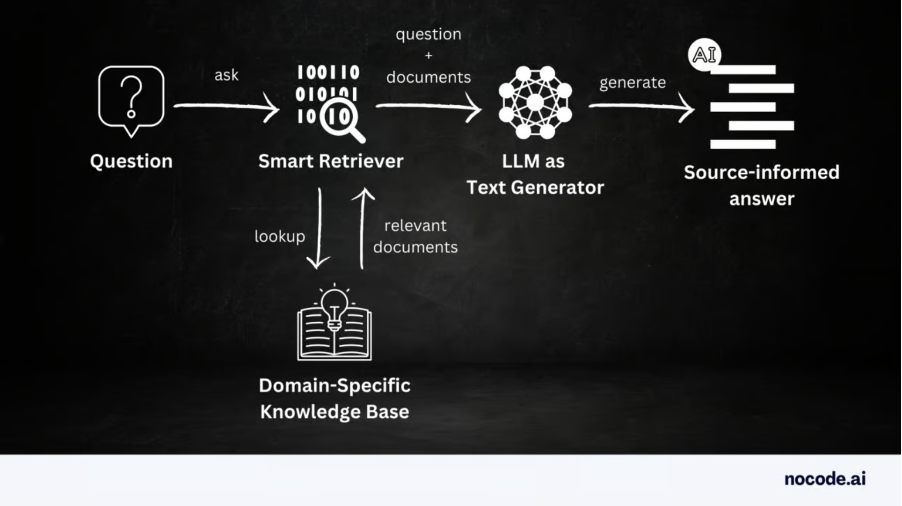
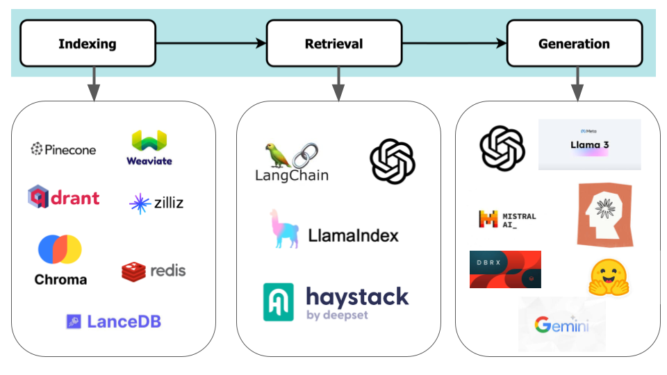
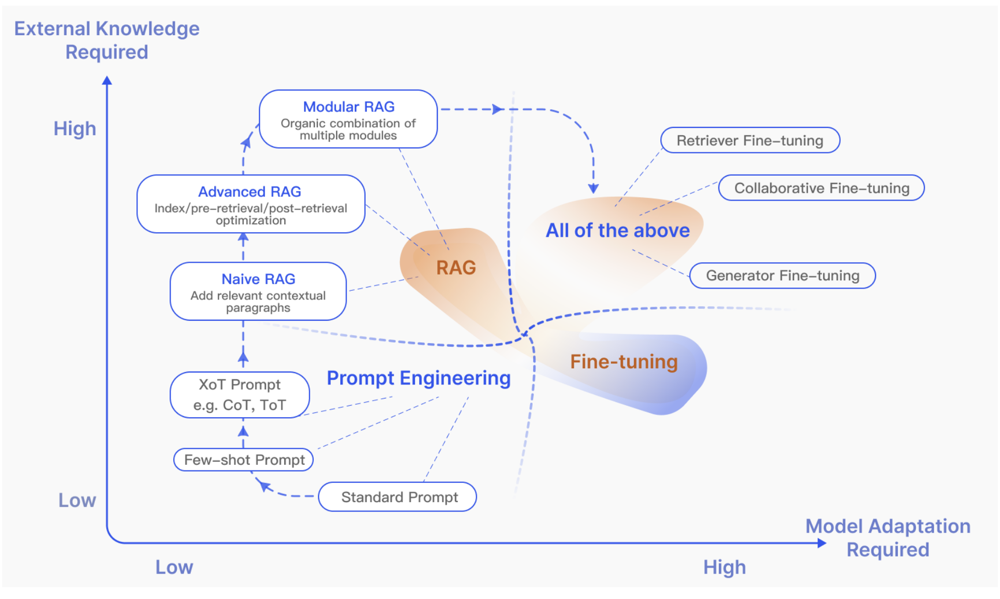
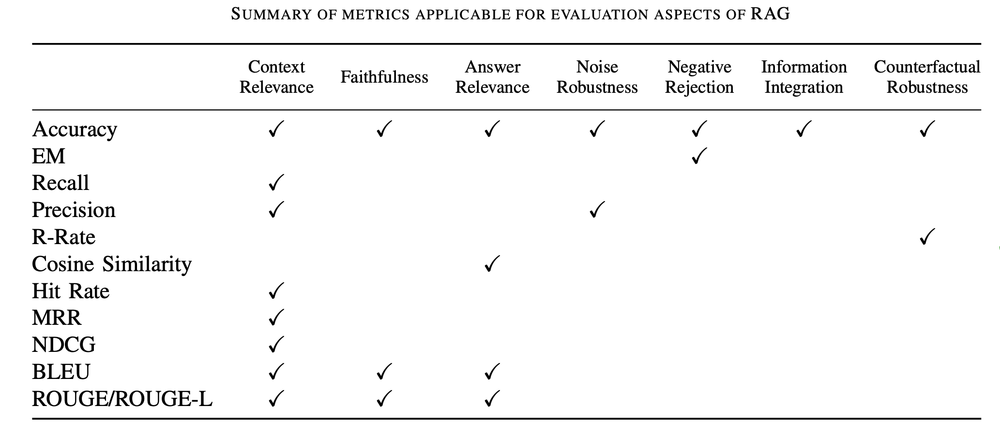
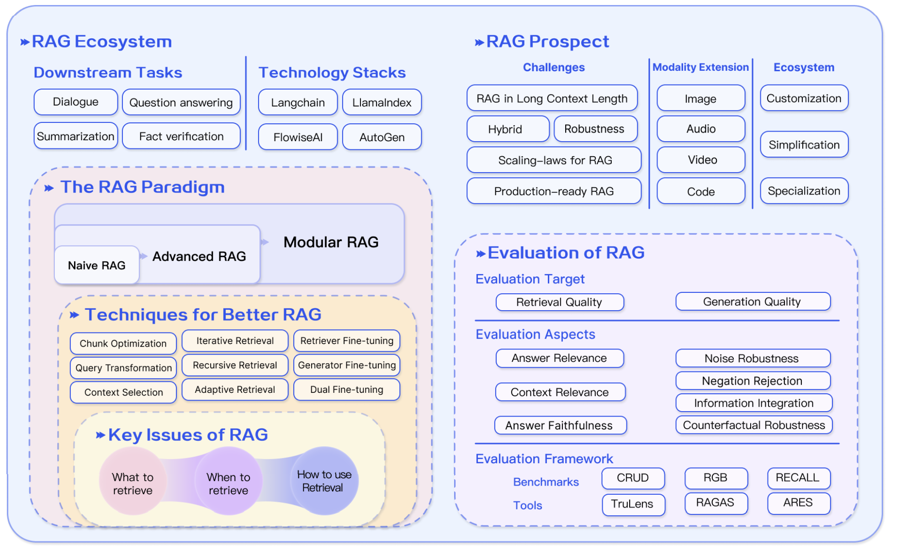

## An Exploratory Tour of Retrieval Augmented Generation (RAG) Paradigm

This is not likely your first read on RAG, nor a last one either. For RAGs are the new rage--rapidly evovling and continually improving--in Generative AI applications. Their remarkable success and study are for good reasons. For one it affords and extends LLMs functionality with practical use cases, spanning various domains for various purposes. And another it mitigates public's fear of LLM's proclvility to confabulations or hallucinations, providing cost-effective solution of plausible responses of LLMs in deployments. 

Courtesy of DALL-E 3

Using published research papers, pratical blogs, and code examples, this article surveys various aspects of RAG paradigms, including their methodologies, functionality, architecture, types, benefits, limitations, and future directions. We'll also touch on RAG evaluations, a key aspect of research emerging in Generative AI applications. 

First, let's start with what is RAG?

### What is Retrieval Augmented Generation (RAG)?

Armand Ruiz, founder of [nocode.ai](https://nodes.ai/), states that RAG marks "a significant evolution in the field of AI, particularly in enhancing the capabilities of large language models (LLMs)" [1]. To expand on this notion, a survey paper by Gao et al. suggest that RAG has emerged as a promising [AI] solution to extend its scope. By incorporating knowledge from external datasource, RAG enhances the accuracy and credibility of the generation, particularly for knowledge-intensive tasks, continuous knowledge updates, and integration of domain-specific information [2]. 

Another comphrehensive examination survey of RAG by Huang et al. also assert that RAG "merges retrieval methods with deep learning advancements to address the static limitations of LLMs by enabling the dynamic integration of up-to-date external information." The study highlights signifcant enhancements in LLM's capabilites [3].

In simpler terms, RAG enhances LLMs by supplementing them with external context, like databases and customer records, to improve their generative responses and accuracy. 

From above it seems clear that by combining external context from an external store and user input, LLM can produce context-tailored and accurate responses. This method, as part of a typical RAG application, is illustrated as high-level RAG data flow in Figure 1.

Figure 1.  High-level RAG data flow and its relevant components

### Why use RAG?

While LLMs dazzle us with their human-like and creative responses, they face limitations and challenges. Because LLMs are probablistic reasoning engines, their outputs can vary with each input. "If the inputs are essentially infinite and the outputs are essentially inifinite, how do you prove [it] is safe?" to use, asks Hugh Harvey of Hardian Health [4]. 

However, one technique being considered widely, to address these challenges, for AI in Health, writes [The Economist](https://www.economist.com/leaders/2024/03/27/the-ai-doctor-will-see-youeventually), is using a RAG. Similarly, Gao et al. propose that RAG improves LLMs by retrieving pertinent document segments from external sources using semantic similarity. By leveraging external knowledge, RAG mitigates the issue of generating inaccurate content [5].

Other reasons, Armond Ruiz enumerates, to employ RAG are slotted into the following categories [6]:

**Knowledge Cutoff**: LLMs rely on limited training data, while RAG taps into external knowledge, combined with user input, for improved accuracy.

**Hallucination Risks**: LLMs can confabulate. RAG adds external data and source to improve accuracy and verifiability.

**Contextual Limitations**: LLMs lack private data context. RAG adds domain-specific data for better responses.

**Auditability**: RAG enhances auditability by citing sources in Generative AI responses.

All of the above make it a compelling choice, for RAG primarily aims to improve LLM response quality through three distinct RAG types.

### Types of RAG

The RAG popularity is burgeoning, and with it, its research paradigm is continuously evolving. RAGS can be categorized into three types: Naive RAG, Advanced RAG, and Modular RAG, as showed in Figure 2 [7].

Figure 2. Different types of RAGs

#### Naive RAG ####
As the name suggests, it's the earliest, simplest, and easiest to implement. Following a simple sequence of stages, it involves three steps: indexing, retrieving, and generating.

##### Indexing #####
Indexing begins by cleaning and extracting raw data from various formats such as PDF, HTML, Word, and Markdown, which is then converted to plain text. To address language model context limitations, text is divided into smaller chunks, encoded into vectors using an embedding model, and stored in a vector database. This allows for effective similarity searches during retrieval.

##### Retreival #####
After indexing, user queries are encoded into vectors using the same embedding model used for indexing. The retriever search algorithm finds the most relevant K chunks that match the query semantically. These retrieved chunks of documents, along with the query, are then coalesced as a coherent prompt for the LLM's final generation stage.

##### Generation #####
The coalesced prompt will trigger the LLM to respond, generating the response from its inherent parameteric knowledge or confine its response to the knowledge in the chunk of retrieved docuements. 

However, Naive RAG has its drawbacks, notes Gao et al., for couple of reaons. First, retrieval phase struggles with precision and recall, meaning it can easily retrieve unaligned chucks of documents. Second, generation could then produce hallucination since the retrieved documents are inaccurate or unaligned. Moreover, in some cases, the phase can "suffer from irrelevance, [redundancy], toxicity, or bias in the outputs, detracting from the quality and reliability of the responses [8].

These shortcomings are addressed with Advanced RAG.

#### Advanced RAG ####
Advanced RAG improves and focuses on the quality of the retrieval phase. It incorporates pre-retrieval and post-retrieval strategies. While pre-retrieval 
focuses on indexing techniques through the use of a sliding window approach, fine-grained segmentation, and the using of metadata, post-trieval concerntrates on re-ranking, re-locating, and shortening chunks into critical sections so that only the most relevant documents are selected and fed into the LLM [9]. Frameworks such
as [LlamaIndex](https://www.llamaindex.ai/), [LangChain](https://www.langchain.com/) and [HayStack](https://haystack.deepset.ai/) have implemented this post-retrieval concept as retriervers [10].

Feeding the most relevant, re-ranked, and reduced documents improves not only the LLM's response, relevance, and reliability but also shortens the context window, reducing the overall cost of inference. 

#### Modular RAG ####
Modular RAG goes beyond the two approaches above. It's versatile by adapting
a modular approach and introducing newer patterns, both incorporating efficient strategies. For instance, for modular components, it can plugin a better similarity search strategy for retrieving components; it can re-write or modify query for
enhanced search result; and it can route searches across various data sources, including search engines, databases, and knowledge graphs, using LLM-generated code and query languages [11-12]. 

For newer patterns, it can implement efficient RAG data-processing pipelines for reranking and rearraning retrieved documents.

Of whatever RAG type you employ for deployment, none gurantees free of inacurracies or confabulation. This continues to be of intense research for future development: generative AI free of hallucinations or inaccuraries. 

So a word of caution is: trust but verify a generated RAG response. Even better, always check the sources used to generate the response.

### How RAG Works?

By now you, you have some intuition of how RAG works at a high-level, comprising of two distinct phases--retrieving and generating--each phase with its distinct purpose and level of sophistication and implementation, as depicted in Figure 3.

Figure 3. General phases of how RAG works

In the retrieval phase, efficient search strategies fetch the most relevant semantic similar documents from a vector store or knowledge base that match the user prompt or query. As noted above in various RAG types, this phase is crucial to ensure that only most relevant documents are coalesced with the prompt for the second phase. Popular generarive AI frameworks like LangChain, LlamaIndex, and Haystack implement these as advanced retrievers. Damian Gil focuses on these advanced retrievers in his immersive blog, [Advanced Retriever Techniques to Improve Your RAGs](https://towardsdatascience.com/advanced-retriever-techniques-to-improve-your-rags-1fac2b86dd61).

For the generation phase, the coalesced and condensed context are provided to LLM to generate the final response. Some prompt engineering may require to fashion suchthe tone and format of the returned response. By some practioners of RAG, this bit within the generation phase is also called __augmentation__, hence its placement in the 
acronym RAG.

At face value, these two phases seem simpler and sequential but a lot of complex computing happens under the hood. Frameworks such as LangChain, LlamaIndex, Haystack, HuggingFace, and OpenAI and vector stores such as Pinecone and others abstract away, via programmatic APIs, functional aspects of indexing, searching, retreiving, re-ranking and re-arranging. All this enables a developers' job a lot easier to simply employ the framework APIs to implement each phase and write a complete RAG for a specific use case.

### Common Use Cases

The RAG-based applications have demonstrated their merits and use across various domains. A few noteable business cases include the following [13,14]: 

1. **Customer question-answering systems**: In domains such as healthcare, manufacturing, and IT, RAG-enhanced chatbots can field questions by retrieving relevant contextual information from internal knowledge base to respond to customer queries. For example, consider a healthcare organization employing RAG models to create a system that provides accurate medical answers by accessing and interpreting medical literature or internal trial records.
2. **Content recommendation systems**: In RecSys realm, it improves user interaction and content engagement by leveraging advanced retreivers for personalized recommendation.
3. **Educational and legal research analysis**: RAG simplifies and creates condensed study materials in education, and for legal analysis and preparation of law cases, access and summarize relevant legal materials for analysis, retreived from internal
legal knowledge base.
4. **Content creation and summarization**: RAG models make content creation easier by finding useful information from different places, including internal knowledge base. They can assist with condensed reports and summaries. For instance, 
writers and researchers at a news company can use an internal RAG models, along with internal knowledge new repository or base, to make news articles or short summaries of long reports.

### RAG Components and Landscape

A standard RAG architecture comprises indexing, retrieval, and generation components, each with open source and closed source software options. Your choice will be influenced by factors like budget, internal skills, and community support for each component. 

Figure 4. Evolving RAG landscape with open and closed source options available for each phase

**Indexing**: In the this phase, documents are processed, segmented, and converted into numerical embeddings for storage in a vector database. The effectiveness of index construction in the vector databse, and its subsequent search, impacts the ability to retrieve the correct context. Gao et al. suggest optimized indexing methods including token chunking, sliding window with overlap, adding metadata (page number, URL, author, category, timestamp,etc.) to enrich chunks, and establishing parent-child document hierarchies within chunks [15]. All this facilitates the search task to retrieve the most relevant chunks semantically relevant to the user query.

Numerous open-source and closed-source vector store options are available for this phase, as shown in the Figure 4.

**Retrieval**: In RAG, efficiently finding relevant documents is essential. This involves key considerations like retrieval source, granularity, pre-processing, re-ranking, and choosing the embedding model. Popular frameworks like LangChain, LlamaIndex, Haystack, and OpenAI provide programmatic interface, as well as embedding models to chose from. Huang et al. outline few retrieval strategies such as search and
ranking, re-ranking, query manipulation, and filtering [16]. These approaches are also discussed above in the Advanced and Modular RAG methodologies.

**Generation**: Finally, this phase heavily relies on the previous two. Without proper indexing of the knowledge base and the retrieval of documents related to the user query, the LLM may not generate the desired coherent response. 

Huang et al. and Gao et al. propose various methods. One is to refine the user query and documents with prompt engineering. Another is to prioritize relevant documents and tailor the system and user prompt to effect the desired tone and format. [17,18]

For this phase, you can use any of the open-source and close-source hosted LLM models' API for generation.

### Prompt Engineering, RAG, and Fine-Tune

Since the release of ChatGPT and LLMs prior to it, they have drawn a considerable amount of attention due to its popularity, purported use cases, and prevalance. Some optimization techiques for LLMs have been confused or conflated with fine-tuning LLM and prompt engineering. Far from it. Each is distinct and has a specific scenario for its method. 

Figure 5. Quadrant chart showing usage and need of each LLM technique

The above figure, as quadrant chart, delineates to illustrate differences among them, and when would you want to use each, based on two axes: external knowledge base and model adaptation requirements [19].

From this quadrant chart, we can conclude that Prompt Engineering involves minimal changes to the model or external knowledge base. It utilizes the inherent parametric-knowledge capabilities of LLMs, using prompting methods such as [zero-short, few-short learning or chain of reasoning](https://medium.com/p/24d2ff4f6bca). 

Initially, in Naive RAG, there's little need for model adjustments. As RAG research advances, Modular and Advanced RAG will increasingly incorporate fine-tuning methods.

Fine-tuning, however, requires additional training of the model with domain-specific dataset, incurring additional cost of training. Fine-tuning is also for form, not necessarily for facts, argues Anyscale Chief Data Scientist Waleed Khadus [20]. It results in creating a niche model for a niche use-case solving
domain specific tasks. 

Moreover, fine-tuning fashions form and format and style and tone of user responses. ChatGPT is an example of fine-tuning GPT4 for instruct and Q&A interaction.

Both fine-tuning and RAG face challenges. Fine-tuning needs  additional domain-specific data for training, struggles with outdated data, requires access to open-source LLM models and hosted solutions, and could produce inaccurate results. 

RAG relies heavily on scalable vector stores, support of efficient retrieval mechanisms in AI developer frameworks, and aspires Advanced and Modular RAG approaches for optimal results. 

Beyond their challenges, each has its merits for its specific use case. Yet all that is fine and RAGs work tremendously well most of the time, but what about when they are faulty and how do you assess them?

### Evaluating RAGs

To assess the effectiveness of RAG-based LLM applications, it's crucial to consider criteria like accuracy, faithfulness, relevancy, and robustness. All this has spurred substantial research into frameworks, methodologies, and metrics to gauge overall effectiveness. 

Recent studies have concentrated on evaluating RAG model performance on downstream tasks using established and traditional metrics like Exact Match (EM) and F1 scores, along with others measures listed in Table 1, observed by Gao et al [21]. These traditional measures are not sufficient nor yet mature or standardized for quantifying RAG evaluation aspects, end-to-end.

Table 1: Summarizing metrics for evaluation aspects of RAGs

To that end, considerable recent research is focused on two areas -- Retrieval-based aspect and Generation-based aspect -- to introduce frameworks and benchmarks aimed to evaluate RAGs end-to-end and wholesomely. Huang et at. in their survey tabulate these comphresenvie frameworks and benchmarks in Table 2 [22]. 

Table 2: The Comparison of Different RAG Evaluation Frameworks and methods

While Retrieval-based frameworks and benchmarks focus on the effectiveness of retrieving relevant information to support generation tasks, the Generate-based aspect concerntrate
on assessing language quality, coherence, relevancy, and accuracy to ground-truth.

Together, these provide a sufficient starting point for assessing RAGs, though on-going research continue in areas including retrieval quality, combining fine-tuning in Advanced RAG methods, scaling laws for RAGs, and mult-model RAGs [23].

### Future Developments

To declare that work in RAGs is done and dusted is dishonest. A field rapidly evolving as GenAI is never complete. Recent literature [24, 25, 26] suggest areas of further research include:

1. Pluggable and modular search methods in Advanced and Modular RAG approaches
2. Multi-model based RAG
3. Simplifying retrieval method, especially during mult-hop retrieval and re-ranking
4. Production-ready RAG
5. RAGs in long-context length

### RAG Examples and tutorials 

1. [Naive RAG with Pinecone vector store, external knowledge, and Claude 3](https://github.com/dmatrix/genai-cookbook/blob/main/rags/01_rag_serach_pinecone_pdf.ipynb)
2. [How to build a retrieval index with Pinecone](https://github.com/dmatrix/genai-cookbook/blob/main/rags/pinecone_upload_pdf_chunks.py)
3. [How to search knowledge index with Pinecone](https://github.com/dmatrix/genai-cookbook/blob/main/rags/rag_search_pinecone_pdf_docs.py)
4. [Naive RAG with LlamaIndex, Elasticsearch and Mistral](https://www.elastic.co/search-labs/blog/rag-with-llamaIndex-and-elasticsearch)
5. [Advanced RAG Techniques](https://www.pinecone.io/learn/advanced-rag-techniques/)
6. [Creating High Quality RAG Applications with Databricks](https://www.databricks.com/blog/building-high-quality-rag-applications-databricks)
7. [Building Real-Time Financial News RAG Chatbot with Gemini and Qdrant](https://medium.com/@akriti.upadhyay/building-real-time-financial-news-rag-chatbot-with-gemini-and-qdrant-64c0a3fbe45b)

### Summary

To sum up, I repeat that is not likely your last read on RAG. Countless others will
follow.

In this article, taking a high-level tour of RAG, we explored RAG paradigms, covered methodologies, functionality, architecture, types, benefits, limitations, and future directions using research papers, practical blogs, and code examples. We also discussed RAG evaluations, an emerging aspect of research in Generative AI applications. 

Figure 6 captures and summarizes, with precise visual granularity, the essence of RAG paradigms [27].

Figure 6. Summary of RAG paradigms

### References and Resources

[1, 14, 21](https://newsletter.nocode.ai/p/)guide-retrieval-augmented-generation
[2,5-7-9,12,15,18-19, 21, 23, 24, 27](https://arxiv.org/pdf/2312.10997.pdf)
[3,16-17, 22, 25](https://arxiv.org/pdf/2404.10981.pdf)
[4](https://www.economist.com/technology-quarterly/2024-03-30)
10. https://towardsdatascience.com/enhancing-rag-pipelines-in-haystack-45f14e2bc9f5
11. https://arxiv.org/abs/2308.11761
13. https://hyperight.com/7-practical-applications-of-rag-models-and-their-impact-on-society/
20. https://www.anyscale.com/blog/fine-tuning-is-for-form-not-facts
26. https://arxiv.org/pdf/2404.13781